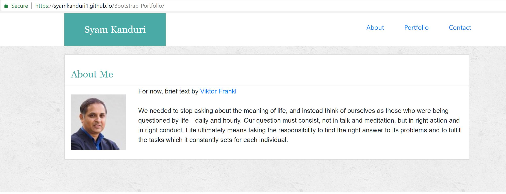

# Bootstrap-Portfolio

<!-- Put the name of the project after the # -->
<!-- the # means h1  -->
# Homework # 2 - building a portfolio

<!-- Put a description of what the project is -->
To build a portfolio  using bootstrap. 

# Link to deployed site
<!-- make a link to the deployed site --> 
<!-- [What the user will see](the link to the deployed site) -->
[my second homework](https://syamkanduri1.github.io/Bootstrap-Portfolio/)


# Images
<!-- take a picture of the image and add it into the readme  -->
<!--  -->



# technology used
<!-- make a list of technology used -->
<!-- what you used for this web app, like html css -->

html, css, Bootstrap
<!-- 
1. First ordered list item
2. Another item
⋅⋅* Unordered sub-list. 
1. Actual numbers don't matter, just that it's a number
⋅⋅1. Ordered sub-list
4. And another item. 
-->


# code snippets
<!-- put snippets of code inside ``` ``` so it will look like code -->
<!-- if you want to put blockquotes use a > -->

```
For example in the the html file, I have coded..
        <nav class="navbar navbar-expand-lg">
            <div class="mx-auto">
                <ul class="nav navbar-nav">
                    <li class="nav-item">
                        <a class="navLink" href="index.html">About</a>
                    </li>
                    <li class="nav-item">
                        <a class="navLink" href="portfolio.html">Portfolio</a>
                    </li>
                    <li class="nav-item">
                        <a class="navLink" href="contact.html">Contact</a>
                    </li>
                </ul>
            </div>
        </nav>

```


# Learning points
<!-- Learning points where you would write what you thought was helpful -->
Bootstrap itself is a great learning!

# Author 
Syam Kanduri

# License
Standard MIT License